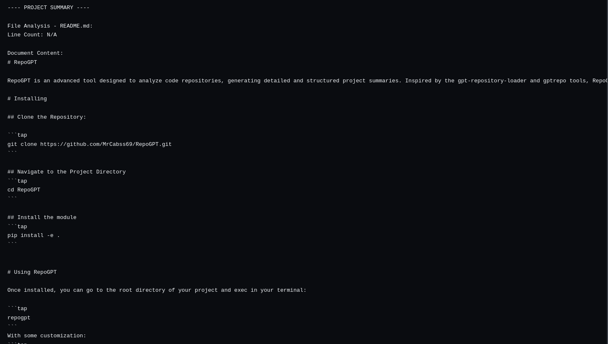

# RepoGPT

RepoGPT is a tool designed to summarize the  code (*.py) and docs (*.md) files in a repository. It works iterating through directories and generating detailed and structured project summaries - including classes, functions and and the docstrings. It supports .txt or .json output files, ready for your favourite LLM to ingest!

Inspired by the [gpt-repository-loader](https://github.com/mpoon/gpt-repository-loader) and [gptrepo](https://github.com/zackees/gptrepo/tree/main).



# Installing

## Clone the Repository:

```tap
git clone https://github.com/MrCabss69/RepoGPT.git
```

## Navigate to the Project Directory
```tap
cd RepoGPT
```

## Install the module
```tap
pip install -e .
```


# Using RepoGPT

Once installed, you can go to the root directory of your project and exec in your terminal:

```tap
repogpt
```
With some customization:
```tap
repogpt --repo_path /path_to_repo --extensions .py .js --start_path src
```

A .txt file will appear in the working directoy, with the summary generated.


## Main Features

- **File Analysis:** RepoGPT performs a deep scan of the files in the repository, collecting crucial information such as line count, classes and their methods, independent functions and associated docstrings.

- **Documentation Improvement:** The tool places special emphasis on the clarity and quality of code documentation, promoting good practices such as the use of clear nomenclatures for variables and detailed documentation strings.

## Detailed Analysis Options

RepoGPT allows you to customize the analysis using the following options:

- `--output`: Defines the file name and extension to output in the analysis. By now .txt and .json formats are accepted. By default, 'example.txt' file are created.

# Structure
```tap.
├── README.md
├── repogpt
│   ├── docs
│   │   ├── DEVELOPING.md
│   │   ├── IDEA.md
│   │   └── TODO.md
│   ├── __init__.py
│   └── tree_build.py
└── setup.py

```